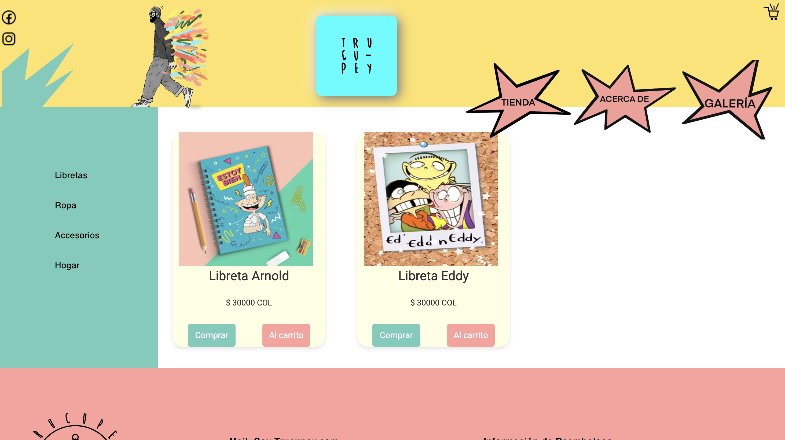
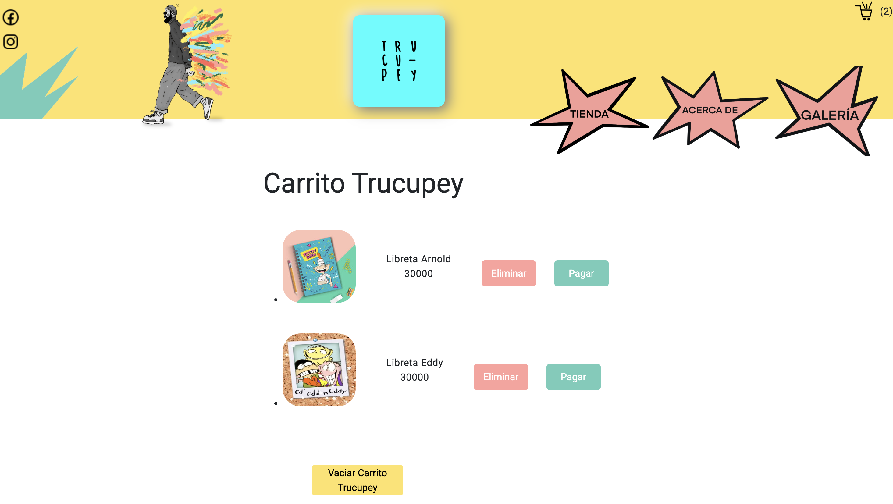
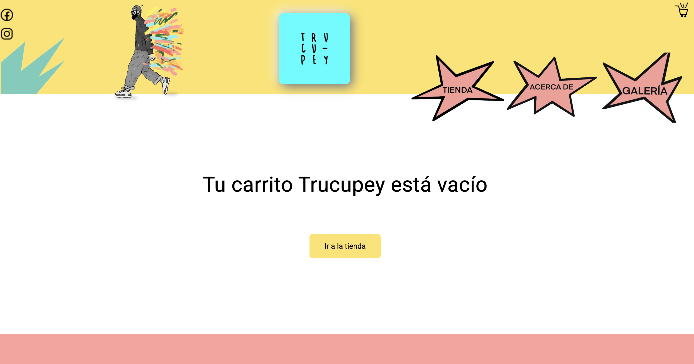
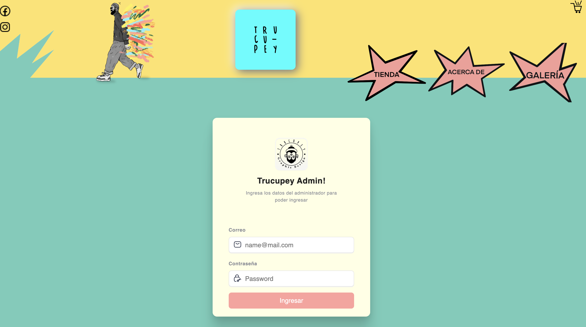
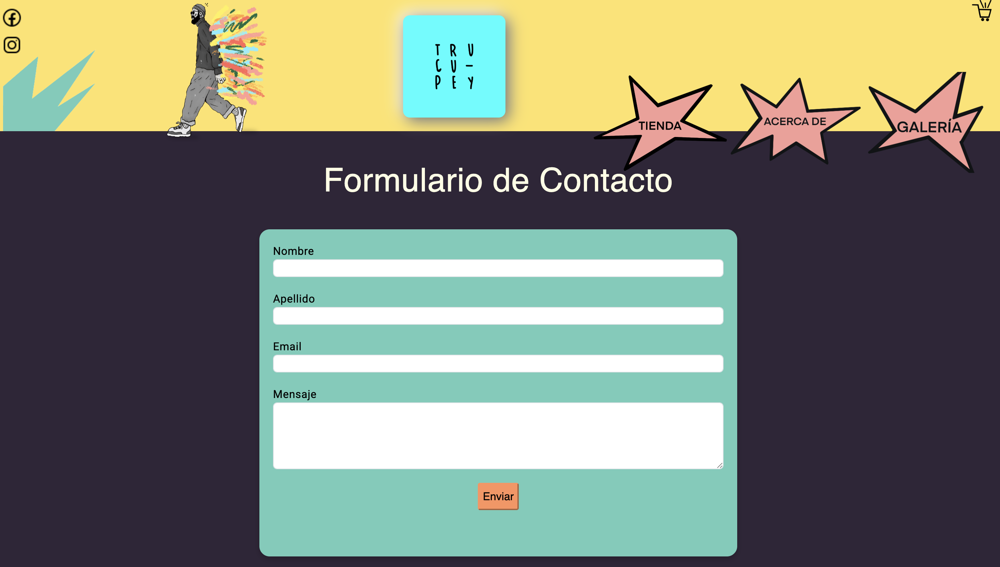
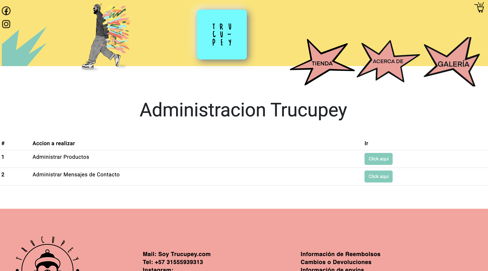
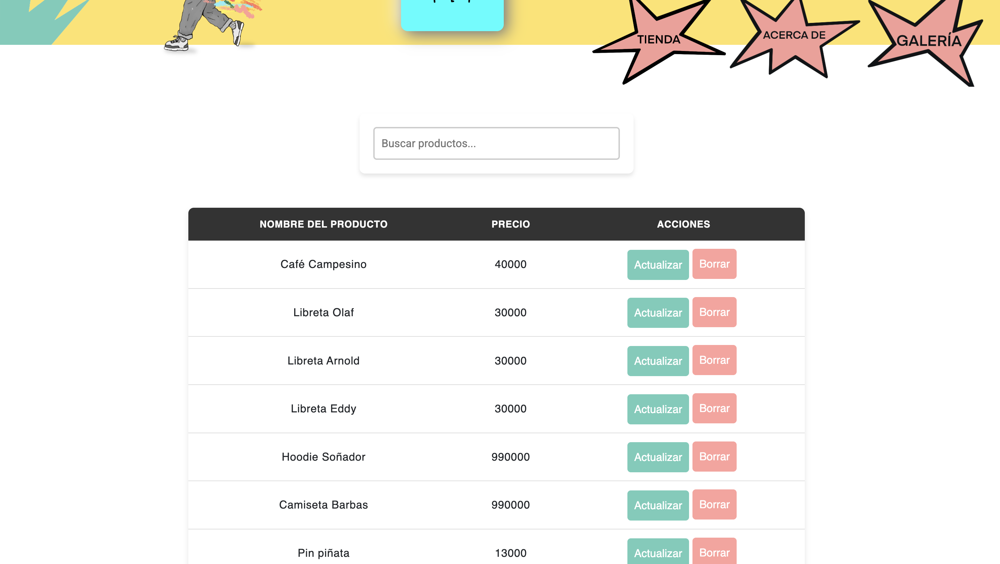
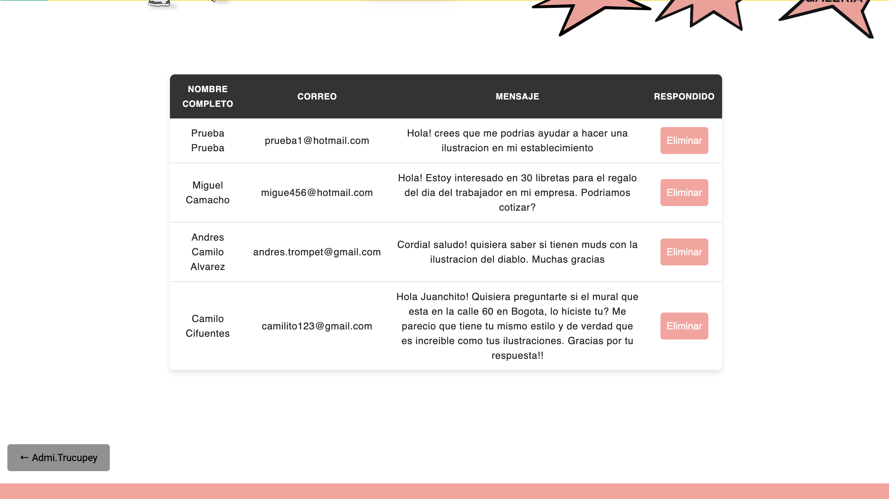

# Trucupey

This project was generated with [Angular CLI](https://github.com/angular/angular-cli) version 18.2.1.

## Development server

Run `ng serve` for a dev server. Navigate to `http://localhost:4200/`. The application will automatically reload if you change any of the source files.

## Code scaffolding

Run `ng generate component component-name` to generate a new component. You can also use `ng generate directive|pipe|service|class|guard|interface|enum|module`.

## Build

Run `ng build` to build the project. The build artifacts will be stored in the `dist/` directory.

## Running unit tests

Run `ng test` to execute the unit tests via [Karma](https://karma-runner.github.io).

## Running end-to-end tests

Run `ng e2e` to execute the end-to-end tests via a platform of your choice. To use this command, you need to first add a package that implements end-to-end testing capabilities.

## Further help

To get more help on the Angular CLI use `ng help` or go check out the [Angular CLI Overview and Command Reference](https://angular.dev/tools/cli) page.

DESCRIPTION:
The design of this website was developed in collaboration with Matías and Ana. I served as the backend and frontend developer to build the entire website.
Website Features: The e-commerce site includes:

- Home 
- Store 
- Car (where you can delete or pay for products)  
- Login (administrator) 
- Customers can send a message, and it is automatically saved to the database 
- Administration, where the administrator can delete, update, and add products. They can also view messages that customers have sent and delete them if the administrator has already responded to them.
- 
- 
- 
